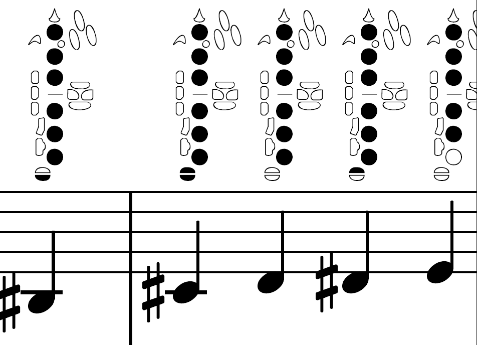
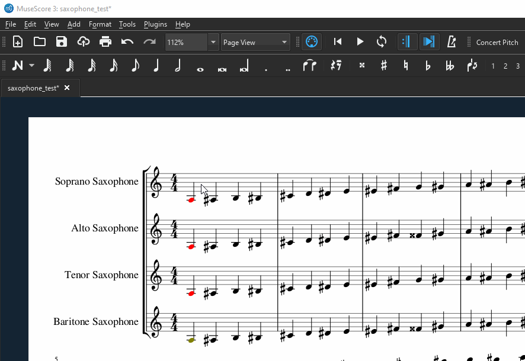

# saxophone-fingerings
Musescore plugin to add saxophone fingerings to your charts.

Created because of [this thread](https://musescore.org/en/node/310327)

## Installation Notes
install [the Saxy font](https://github.com/Marr11317/Saxy) ([TTF](redist/Saxy.ttf?raw=true), [OTF](redist/Saxy.otf?raw=true))

## Usage
Select your part and run the _appropriate_ plugin

