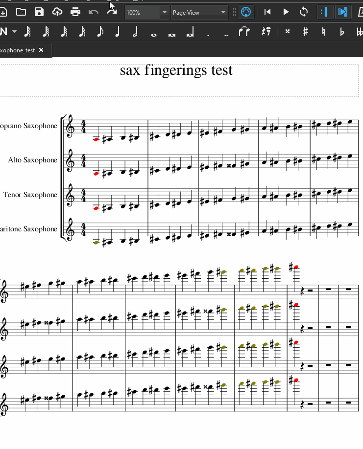

# saxophone-fingerings
Musescore plugin to add saxophone fingerings to your charts.

Created because of [this thread](https://musescore.org/en/node/310327)

## Installation Notes
install [the sax fingerings **EURO** font](https://musescore.org/sites/musescore.org/files/2020-09/SaxophoneTablature.zip)

## Usage
Select your part and run the _appropriate_ plugin

